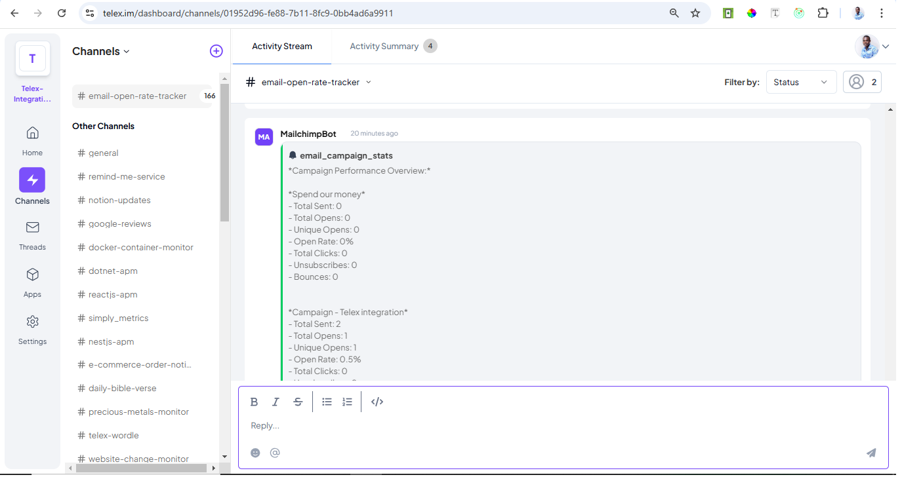

# Mailchimp Campaign Stats Integration

### Overview

This integration fetches campaign performance statistics from Mailchimp and sends a structured summary to a specified Telex channel via a webhook. It provides insights into key metrics such as open rates, click rates, bounces, and unsubscribes.

## Table of Contents

- [Live url](#url)
- [Overview](#overview)
- [Features](#features)
- [Technology Stack](#technology-stack)
- [Project Setup](#project-setup)
  - [Prerequisites](#prerequisites)
  - [Installation](#installation)
  - [Environment Variables](#environment-variables)
  - [Running the Application](#running-the-application)
- [Run Test](#run-test)
- [Screenshot](#Screenshot)
- [API Documentation](#api-documentation)
- [Contributing](#contributing)
- [License](#license)

## Live url

`https://email-tracking-f7t5.onrender.com/api/v1/`

# Features

- Fetch campaign reports from Mailchimp

- Extract key performance metrics (opens, clicks, bounces, unsubscribes, etc.)

- Format statistics into a readable summary

- Send campaign performance stats to Telex via webhook

## Technology Stack

- **Backend:** Node.js with Express.js (typescript).
- **Hosting:** Render

## Project Setup

### Prerequisites

Before setting up the project, ensure you have the following installed:

- [Node.js](https://nodejs.org/) (v14 or later)
- [Yarn](https://yarnpkg.com/) (v1.x)
- [PostgreSQL](https://www.postgresql.org/) (Ensure the database is running and accessible)
- Ensure redis is running on your system or server.

### Installation

1. **Clone the repository:**

   ```bash
   git clone https://github.com/LivingHopeDev/email-open-rate-tracking-integration.git
   cd email-open-rate-tracking-integration
   ```

2. **Install dependencies:**

   ```bash
   yarn install
   ```

### Environment Variables

Create a `.env` file in the root of the project and configure the following environment variables:
Check `.env.example ` file

```env

MAILCHIMP_API_KEY= # Your mailchimp API key
MAILCHIMP_DATA_CENTER="usX"
FROM_EMAIL=   # Your mailchimp email
TELEX_WEB_HOOK=   # Your webhook from telex channel


```

### Running the Application

#### Start the development server

```
yarn run start:dev

```

# API Documentation

### 1. Send Email Campaign

`POST /api/v1/email/send`

**Request Body:**

```json
{
  "listId": "8e21609af5", # Audience ID from mailchimp
  "subject": "Telex integration",
  "htmlContent": "This is the latest newsletter for the telex integration",
  "fromName": "sender's name",
  "replyTo": "sender's email"
}

```

**Response:**

```
{
  "message": "Campaign created and sent successfully.",
  "campaignId": "<campaign_id>",
  "sendResponse": "<mailchimp_response>"
}
```

### 2. Get All Campaign Stats

**Endpoint**
`GET /api/v1/email/stats/all`

**Response:**

```json
{
  "status": 200,
  "message": "Campaign stats fetched and sent successfully!"
}
```

### 3. Get Single Campaign Stats

**Endpoint**

`GET /api/v1/email/stats/{campaignId}`
**Response:**

```json
{
  "stats": {
    "total_recipients": 2,
    "total_opens": 1,
    "unique_opens": 1,
    "open_rate": 0.5,
    "last_open": "2025-02-20T13:57:02+00:00",
    "bounces": 0
  }
}
```

### Webhook Integration

- Campaign statistics are automatically sent to Telex via a webhook.

#### Access the application

The server will start on the specified PORT in your .env file. If PORT is set to 8000, the application will be available at <http://localhost:5000>.

### Run Test

```
yarn test
```

### Screenshot



### License

This project is licensed under the MIT License - see the LICENSE file for details.

### Key Points

- The `README.md` provides a comprehensive guide on setting up the project locally, including installation instructions, environment variable configuration, and starting the server.
- Since the API documentation is not yet available, it includes a placeholder indicating that it will be provided later.
- The setup instructions are tailored specifically for a Node.js and PostgreSQL environment using Yarn.

This `README.md` file should serve as a solid foundation for your project documentation. Let me know if you need any changes or additional information!
